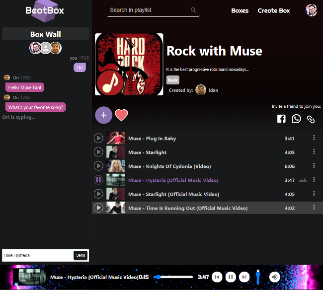

  

# BeatBox  
#### you can check it out on: 
https://ca-beatbox.herokuapp.com/
## What it is?  

It is a social-music app. It allows you to listen to music and edit playlists called "Boxes" with friends.
just choose one of the available boxes or create your own. Then invite your friends to join with with the share links
either via Whatsapp, Facebook or just plain old URL link to paste.
when your friends are there with you, you all listen to same song playing, synchronously. 
if someone makes a change to the playlist, you see it too. You all share the same playlist and the play status (besides volume).
You can chat with the other users using the "Box Wall".
If you sign-up, you can have your own avatar shown, keep your favorite boxes, and delete your created boxes.
  

## What is it for?
Well basically this is a showcase for the things i learned in the course.
It's a final project for Coding Academy's bootcamp. 
We were 3 teammates and we worked on it for almost 2 weeks.

## What tech stack is used?
It was built as an end-to-end project, implements CRUD using REST API methodology and web sockets.
#### Backend:
Node.js, MongoDB, Express
#### Frontend:
React.js, Sass, Redux
